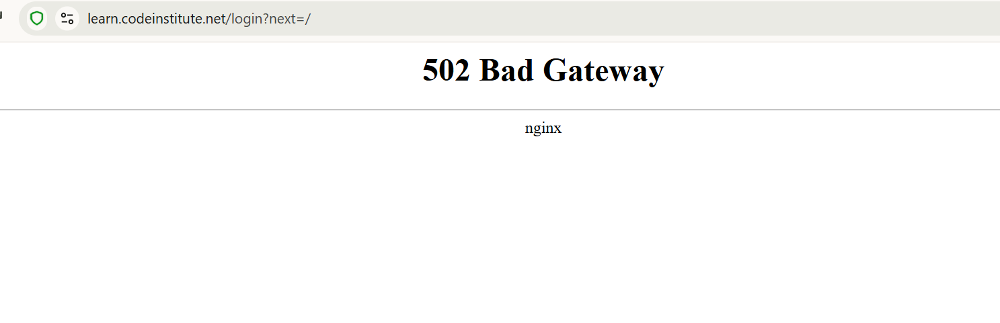
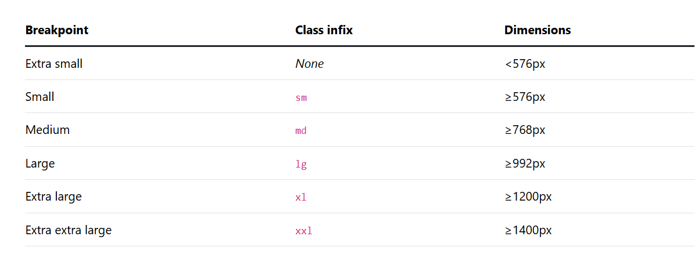

# Trailblazers
<!-- Link to website -->
[Im an inline-style link] (url)

<!-- Come back to this. this is place holder text -->
Trailblazers is an inclusive website built for LGBTQ+ nature lovers looking to connect with others through hiking. It features a gallery, event listings with booking inquiries, contact details, and visible pricing (including student discounts). Designed with accessibility and responsive design in mind, it provides easy navigation, high-quality visuals, and all the info you need to hit the trails with new friends. 
<!-- image of website on all screen sizes look at reference  -->
![image of website on all screen sizes] (url)

[Contents]()  
* [User Goals](#user-goals)  
* [User Stories](#user-stories)  
* [Website Goals and Objectives](#website-goals-and-objectives)  
* [Wireframes](#wireframes)  
* [Design Choices](#design-choices)  
  * [Typography](#typography)
  * [Colour Scheme](#colour-scheme)  
  * [Images](#images)  
  * [Responsiveness](#responsiveness)
* [Features](#features)  
  * [Existing Features](#existing-features)  
    * [Header](#header)  
    * [Landing View](#landing-view)  
    * [Events](#events)
    * [Gallery](#gallery)
    * [Booking form](#booking-form)
    * [Footer](#footer)   
* [Technologies Used](#tech-used)  
  * [Languages](#languages)  
  * [Libraries & Framework](#libraries-framework)  
  * [Tools](#tools)  
* [Testing](#testing)  
  * [Bugs Fixed](#bugs-fixed)  
  * [Responsiveness Tests](#responsiveness-tests)
  * [Code Validation](#code-validation)  
    * [HTML](#html)
    * [CSS](#css)
  * [User Story Testing](#user-story-testing)  
  * [Feature Testing](#feature-testing)  
  * [Acessibility Testing](#acessibility-testing)  
  * [Lighthouse Testing](#lighthouse-testing)
  * [Brower Testing](#browser-testing)
* [Deployment](#deployment)  
  * [To deploy the project](#deploy-project)  
  * [To fork the project](#fork-project)
  * [To clone the project](#clone-project)
* [Credits](#credits)  

## User Goals 

* User friendly navigation and responsive design
* Find inclusive hiking events
* Learn about hike locations and details
* View pictures from past events
* Book or Inquire about events quickly
* Visible pricing for events

## User Stories 

* As a user i want, i want to easily discover upcoming hikes where i can feel part of a supportive community.
* As a user, I want clear information about where the hikes take place, what to expect(diffculty, terrain, duration) and how to prepare.
* As a user, I want to reassurance as a first-time hiker that there are events that are beginner-friendly.
* As a user, I want to browse a gallery to get a feel for the types of locations visited and the community vibe.
* As a user, I want a simple and accessible way to book a hike.
* As a user, I want to be able to access contact information quickly.
* As a user, I want to be able to browse pricing easily and see if there are any discounts.(student rates)
* As a user, I want to be to use the website on phone, tablet or desktop.

## Website Goals and Objectives  
* Grow the community and increase members
* Boost ticket sales for events
* Encourage participation from all skill levels 
* Foster connection through pictures and written content
* Create a welcoming online space for LGBTQ+ individuals 
* Use the site to actively recruit new members espe
* Increase ranking on search engine to increase website traffic
*  Present up-to date event information with clear times, locations, and pricing.

## Target Audience
* Hiking enthusiasts 
* LGBTQ+ people 
* Students
* First-time hikers  
## Wireframes
The wireframes were designed using Balsamiq. Designed with mobile first practices, tablet and then website.
<!-- Insert Wireframes -->
 

## Design Choices
### Typography
<!-- Review and see which font was used 
Add link to choosen fonts -->
The font family choose for the Trailblazers website was Comfortaa/Baloo 2 for the primary font. Karla/Nunito for the secondary font. These fonts were choosen for their joyful and inviting feel.

### Colour Scheme
<!-- Add in colour scheme chart and constract block -->
    
   

| CSS name     | HEX   | Comment   |
|--------------|--------------|--------------|
| Row 1 Cell 1 | Row 1 Cell 2 | Row 1 Cell 3 |
| Row 2 Cell 1 | Row 2 Cell 2 | Row 2 Cell 3 |
| Row 3 Cell 1 | Row 3 Cell 2 | Row 3 Cell 3 |
| Row 4 Cell 1 | Row 4 Cell 2 | Row 4 Cell 3 |

### Images
<!-- make pexel a hyperlink -->
Hiking images are taken from [pexel](https://www.pexels.com/).

### Responsiveness 
My website is repsonsive to all screen sizes. The breakpoints i am using are from bootstrap.

## Features  
<!-- Placeholder text -->
This website offers a range of thoughtful and inclusive features designed to create a welcoming and accessible experience for all users. From the moment visitors land on the site, they are greeted with vibrant imagery and a clear call to action. The events section highlights upcoming hikes with detailed information, including dates, locations, and pricing—featuring student discounts to ensure inclusivity. A responsive booking form makes it easy to inquire about events, and the gallery showcases the spirit of the community through high-quality images. Easy navigation, clear layout, and a mobile-friendly design ensure users can explore and engage with the site on any device.
## Existing Features
### Header
The header is consistent across all screen sizes. It contains a logo on the left and on the right, navigation links to the Gallery, Events, Contact and Home page. Clear, user-friendly layout helps users orient themselves quickly with intitutive design.
### Home page
* Welcoming landing section with a bold mission statement.

* High-quality background imagery to create a warm, inclusive first impression.

* Call-to-action button encourages users to book a hike or view upcoming events.  

### Events
*Lists upcoming hikes with dates, locations, and brief descriptions.

*Pricing is visible, with clear mention of student discounts.

* Each event includes a “Book Now” button that links to the inquiry form.  

### Gallery
* Displays high-quality images from past hikes and events.

* Reflects diversity and inclusivity of the community.

* Encourages new users to get a feel for the experience before booking.  

### Booking Form
* A responsive form that collects name, email, event type, date, and special requests.

* Includes form validation to ensure submissions are complete and accurate.

* Confirmation message or redirect on successful submission.  

### Footer
* Includes contact information, social media links, and copyright.

* Designed to be accessible and mobile-friendly.

* Repeats essential navigation links for ease of use.

## Technologies Used
### Languages
* HTML
* CSS

### Libraries & Framework
* [Google Fonts](https://fonts.google.com/).
* [Fav Icon](https://fontawesome.com/).

### Tools
* [Github](https://github.com/)
* [Balsamiq](https://balsamiq.com/)
* [W3C HTML Validation Service](https://validator.w3.org/)  
* [W3C CSS Validation Service](https://jigsaw.w3.org/css-validator/)
* [Color Contrast Accessibility Validator](https://jigsaw.w3.org/css-validator/)
https://www.audioeye.com/color-contrast-checker/

## Testing
### Bugs
<!-- Write some lines about the testing -->
| Bug        | Status                         | Description | Steps To Resolve     |
|----------------|--------------------------------------|------------------|------------|
| Header         | Site title and navigation menu       | All pages        | Completed  |
| Events Section | Lists hikes with dates and prices     | Events page      | Completed  |
| Booking Form   | Allows users to request event info    | Contact page     | Completed  |
| Gallery        | Displays images from past events      | Gallery page     | Completed  |

### Responsiveness Tests
<!-- Write some lines about the responsiveness testing   -->
| Size      | Device Example   | Navigation       | Element Alignments | Content Placement | Functionality       | Notes                  |
|-----------|------------------|------------------|---------------------|--------------------|----------------------|-------------------------|
| XS        | Mobile (320px)   | Hamburger menu    | Centered            | Stacked vertically | Fully functional     | Optimized for touch     |
| SM        | Mobile (375px)   | Hamburger menu    | Centered            | Stacked vertically | Fully functional     | Slightly more spacing   |
| MD        | Tablet (768px)   | Top nav visible   | Centered            | Two-column layout  | Fully functional     | Adjusted image scaling  |
| LG        | Small laptop     | Full nav bar      | Left-aligned        | Grid layout        | Fully functional     | Good readability        |
| XL        | Desktop (1200px) | Full nav bar      | Left-aligned        | Wide grid layout   | Fully functional     | Spacious layout         |
| XXL       | Large desktop    | Full nav bar      | Left-aligned        | Extra-wide layout  | Fully functional     | Lots of white space     |
| Print     | N/A              | N/A               | Auto-aligned        | Simplified         | Read-only            | Print-friendly styling  |
| Zoom 75%  | All devices      | Responsive        | Scales down         | Reflows correctly  | Fully functional     | Text remains legible    |
| Zoom 125% | All devices      | Responsive        | Scales up           | Reflows correctly  | Fully functional     | Good accessibility      |
| Portrait  | Tablet/Phone     | Responsive        | Centered            | Stacked            | Fully functional     | Adapts orientation well |

## Code Validation
### HTML
I have used [W3C HTML Validation Service](https://validator.w3.org/). I have tested [insert number of pages here]. 
<!-- did they come back with errors. Include screen shots -->
### CSS
I have used [W3C CSS Validation Service](https://jigsaw.w3.org/css-validator/). I have tested [insert number of pages here]. 
<!-- did they come back with errors. Include screen shots -->

## User Story Testing
|   User Story   | Result             | Pass                | Screenshot    |
|--------------|------------------------|-----------------------------------------------------|----------------------------------------------------|
| 1            | First-time visitor     | Learn about the hiking group                        | I can decide if I want to join a hike              |
| 2            | Regular hiker          | View upcoming events                                | I can plan my next hike                            |
| 3            | New member             | Submit a booking inquiry form                       | I can reserve a spot for a hike                    |
| 4            | Student                | See available discounts                             | I can participate at a lower cost                  |
| 5            | Mobile user            | Navigate easily on my phone                         | I can use the site on the go                       |
| 6            | Curious browser        | View photos from past hikes                         | I can get a feel for the experience                |
| 7            | Event planner          | Access contact details                              | I can reach out with questions or suggestions      |
| 8            | Inclusive community-seeker | Join a safe and welcoming group                   | I can hike without fear of discrimination          |

## Feature Testing
This website was extensively tested for functionality using both Chrome and Edge developer tools.
<!-- needs something else here -->

## Lighthouse Testing
The Trailblazers website has been tested in the Chrome Dev Tools and Microsoft Edge Dev Tools using Lighthouse Testing tool which inspects and scores the website for the following criteria:

*Performance - how quickly a website loads and how quickly users can access it.
*Accessibility - test analyses how well people who use assistive technologies can use your website.
*Best Practices - checks whether the page is built on the modern standards of web development.

<!-- Insert images of lighthouse testing -->
  
  
    
  

### Brower Testing

## Deployment
### To deploy the project
The Trailblazers website was deployed early in the process to GitHub pages via the following steps:

* Navigate to the repository on GitHub and click on Settings.

* In the side navigation and select Pages.

* In the None dropdown and choose Main.

* Click on the Save button.

The website is now live at https://Court-pencil.com.

Any changes required to the website, they can be made, committed and pushed to GitHub.

### To Frok the Project
Forking the GitHub repository allows you to create a duplicate of a local repository. This is done so that modifications to the copy can be performed without compromising the original repository.

* Log in to GitHub.
* Locate the repository.
* Click to open it.
* The fork button is located on the right side of the repository menu.
* To copy the repository to your GitHub account, click the button.

### To clone the project
* Log in to GitHub.
* Navigate to the main page of the repository and click Code.
* Copy the URL for the repository.
* Open your local IDE.
* Change the current working directory to the location where you want the cloned directory.
* Type git clone, and then paste the URL you copied earlier.
* Press Enter to create your local clone.

## Credits
* Feedback, advice and support:  
   * [Simen Daehlin](https://github.com/Eventyret)

* Code inspiration and learning content:
* Visual content:  
  * [Coolors](https://coolors.co/)  
  * [Contrast Grid](https://contrast-grid.eightshapes.com/?version=1.1.0&background-colors=&foreground-colors=%23FFFFFF%2C%20White%0D%0A%23F2F2F2%0D%0A%23DDDDDD%0D%0A%23CCCCCC%0D%0A%23888888%0D%0A%23404040%2C%20Charcoal%0D%0A%23000000%2C%20Black%0D%0A%232F78C5%2C%20Effective%20on%20Extremes%0D%0A%230F60B6%2C%20Effective%20on%20Lights%0D%0A%23398EEA%2C%20Ineffective%0D%0A&es-color-form__tile-size=compact&es-color-form__show-contrast=aaa&es-color-form__show-contrast=aa&es-color-form__show-contrast=aa18&es-color-form__show-contrast=dnp)
* Images: [pexel](https://www.pexels.com/)

