# Trailblazers

[Trailblazers](https://court-pencil.github.io/Trailblazers/)

Trailblazers is an inclusive website built for LGBTQ+ nature lovers seeking connection through hiking. It features a vibrant gallery, detailed event listings with visible pricing and booking inquiries, a beginner-friendly hiking guide, and accessible contact options. Designed with responsiveness and accessibility in mind, the site offers intuitive navigation, high-quality visuals, and all the information needed to hit the trails with new friends.

[Contents]()

- [User Goals](#user-goals)
- [User Stories](#user-stories)
- [Website Goals and Objectives](#website-goals-and-objectives)
- [Wireframes](#wireframes)
- [Design Choices](#design-choices)
  - [Typography](#typography)
  - [Colour Scheme](#colour-scheme)
  - [Images](#images)
  - [Responsiveness](#responsiveness)
- [Features](#features)
  - [Existing Features](#existing-features)
    - [Header](#header)
    - [Landing View](#landing-view)
    - [Events](#events)
    - [Gallery](#gallery)
    - [Booking form](#booking-form)
    - [Footer](#footer)
  - [Future Enhancements](#future-enhancements)
- [Technologies Used](#tech-used)
  - [Languages](#languages)
  - [Libraries & Framework](#libraries-framework)
  - [Tools](#tools)
- [Testing](#testing)
  - [Bugs Fixed](#bugs-fixed)
  - [Responsiveness Tests](#responsiveness-tests)
  - [Code Validation](#code-validation)
    - [HTML](#html)
    - [CSS](#css)
  - [User Story Testing](#user-story-testing)
  - [Feature Testing](#feature-testing)
  - [Acessibility Testing](#acessibility-testing)
  - [Lighthouse Testing](#lighthouse-testing)
  - [Brower Testing](#browser-testing)
- [Deployment](#deployment)
  - [To deploy the project](#deploy-project)
  - [To fork the project](#fork-project)
  - [To clone the project](#clone-project)
- [Credits](#credits)

## User Goals

Trailblazers was designed with a strong focus on user-centered design, reflecting the needs of LGBTQ+ hikers of all experience levels. The site ensures every visitor can easily find information, feel welcomed, and join in on upcoming community events. 

- User friendly navigation and responsive design.
- Find inclusive hiking events.
- Learn about hike locations and details.
- View pictures from past events.
- Book or Inquire about events quickly.
- Visible pricing for events.

## User Stories

- As a user, I want clear details about each hike — including location, date, duration, and terrain — so I can decide if it’s right for me.
- As a user, I want reassurance as a first-time hiker that there are events that are beginner-friendly.
- As a user, I want to browse a gallery to get a feel for the community vibe.
- As a user, I want a simple and accessible way to book a hike and find contact information.
- As a user, I want to be able to see that this is a inclusive space.
- As a user, I want to be able to browse pricing easily.
- As a user, I want to be to use the website on phone, tablet or desktop.

## Website Goals and Objectives

- Grow the community and increase members.
- Boost ticket sales for events.
- Encourage participation from all skill levels.
- Foster connection through pictures and written content.
- Create a welcoming online space for LGBTQ+ individuals.
- Increase ranking on search engine to increase website traffic.
- Present up-to date event information with clear times, locations, and pricing.

## Target Audience

- Hiking enthusiasts
- LGBTQ+ people
- First-time hikers

## Wireframes

The wireframes were designed using Balsamiq. Designed with mobile first practices, tablet and then website. 
The final design of the Trailblazers site evolved from the original wireframes to create a smoother, more intuitive user experience. While the wireframes helped establish the initial structure—such as homepage layout, events section, and booking form the final version refines these elements for better flow and clarity.  

My wireframes evolved significantly from the initial designs. I originally started with a single scrolling layout to support a seamless user experience, based on the common behavior of users simply scrolling through content.  

Midway through development, I shifted to a multi-page structure to better organize information and improve navigation. I moved the “About Us” section to its own dedicated page, created a new page for the beginner’s guide, and relocated the booking form to a separate page with a clear button to return to the homepage.  

The homepage now features a welcoming hero image as the header, followed by upcoming hikes — the information users are most likely to seek first. This is followed by a gallery that showcases Trailblazers as a friendly and inclusive space. For those wanting to learn more about the organization, the “About Us” page offers deeper insight, while beginners can access the guide to understand what to bring and how to prepare.

## Design Choices

### Typography

The font family chosen for the Trailblazers website was Bree Serif for the primary font. Lato for the secondary font. These were chosen for approachability, readability and friendliness, aligning with the site's welcoming and inclusive brand identity.

Together, Bree Serif and Lato help the site feel both inclusive and trustworthy. Bree Serif brings softness and warmth to the design, while Lato keeps longer content clear and easy to read, such as hiking guides and event descriptions.

### Colour Scheme

The colour scheme was chosen based on colours you find out in nature on a walk. The lavender was chosen as it is a reference to queer culture. This combination of a nature-inspired palette and queer symbolism celebrates the community’s identity while keeping accessibility front and center, supported by contrast checks using the contrast grid.

I used [Contrast Grid](https://contrast-grid.eightshapes.com/ "Contrast Grid") to check effective color pairings that support readability and to identify combinations that may hinder legibility due to insufficient contrast or visual discomfort.

| CSS Name             | HEX     | Comment                                            |
| -------------------- | ------- | -------------------------------------------------- |
| --green              | #293b31 | background colour of navbar, footer, button and h2 |
| --lighter yellow     | #D19C1D | font colour on navbar, footer, h2, header          |
| --pale-green         | #bebe5e | icon colour and button font                        |
| --lavender           | #d6c7e1 | button hover colour, icon hover colour             |
| Other Colors CSS Hex |         |                                                    |
| green                | #198755 | colour for beginner difficulty                     |
| yellow               | #ffc107 | colour for intermediate difficulty                 |
| red                  | #dc3545 | colour for challenging difficulty                  |  

Difficulty levels for hikes also follow a traffic-light color system:

Green (#198755) = beginner-friendly.

Yellow (#ffc107) = intermediate.

Red (#dc3545) = challenging.

By using the familiar traffic light system, this design supports quick recognition and builds confidence. It gently guides first-time hikers who may be unsure of their abilities, making trail selection feel approachable and empowering.

### Images

I selected images that reflect a broad spectrum of diversity, intentionally featuring the same individuals throughout to foster a sense of community, connection, and visual cohesiveness.  

Images are taken from:

- [Pexels](https://www.pexels.com/)
- [unsplash](https://unsplash.com/)

### Responsiveness

My website is repsonsive to all screen sizes. The breakpoints i am using are from Bootstrap.
| Breakpoint | Class infix | Dimensions | | |
|-------------------|-------------|------------|---|---|
| Extra small | None | <576px | | |
| Small | sm | ≥576px | | |
| Medium | md | ≥768px | | |
| Large | lg | ≥992px | | |
| Extra large | xl | ≥1200px | | |
| Extra extra large | xxl | ≥1400px | | |

## Features

- Mobile-First Responsive Design – Built with a mobile-first approach to ensure the site looks and works seamlessly on phones, tablets, and desktops.

- Hero Section – A welcoming hero banner with clear branding and an introduction to the group’s purpose.

- Upcoming Hikes Section – Lists each planned hike with full details, including date, distance, duration, terrain type, difficulty level, and price.

- Gallery – Displays photos from past hikes, capturing the group’s inclusive and adventurous atmosphere.

- About us - Gives an backstory on how Trailblazers started and includes a mission statement.

- Beginner's Guide - For first time hikes gives a guide on what to the weather, what to wear and what to bring.

- Booking Form – Allows visitors to sign up for events directly through the site.

- Intuitive Navigation – Simple, clear menu structure for quick access to all pages.

- Consistent Styling – Nature-inspired color palette, accessible typography, and clean layout for readability and visual appeal.

## Existing Features

### Header

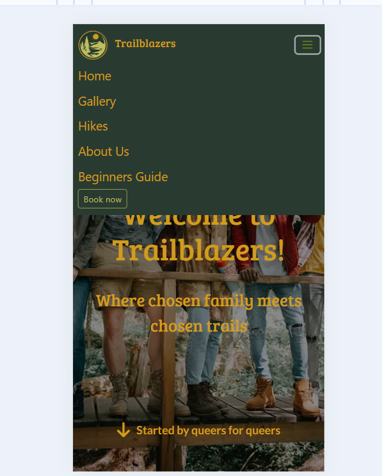

The header maintains a consistent and responsive layout across all screen sizes. On larger screens, it features a logo on the left and navigation links to the Gallery, Hikes, About us, Beginners guide and Home pages on the right, alongside a prominent “Book Now” call-to-action button. On smaller screens, the navigation adapts into a mobile-friendly menu using a burger icon drop-down menu. The clear, user-friendly design helps users orient themselves quickly with intuitive and accessible navigation.

### Home Page

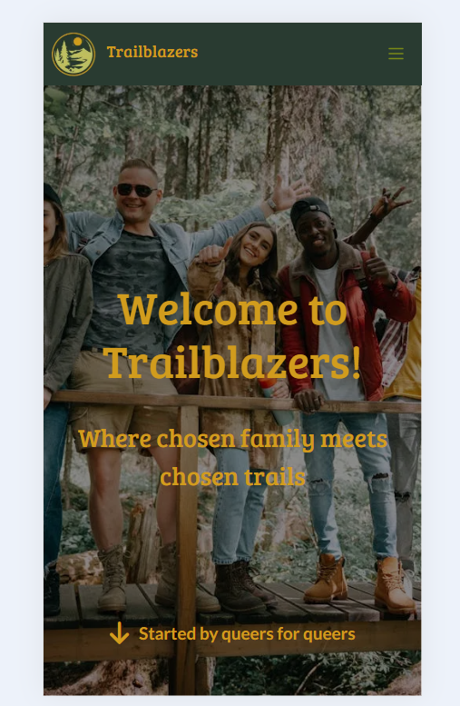
- Welcoming Landing Section: The homepage opens with a bold, affirming mission statement that immediately sets the tone for inclusivity and adventure.  

- High-Quality Background Imagery: The hero section features a warm, nature-inspired image that evokes a sense of belonging and exploration—perfect for your queer-friendly hiking theme.

### Events

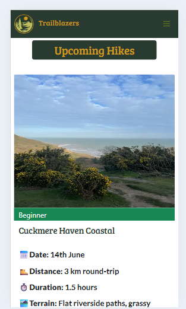

- Upcoming Hikes Listed: Each event clearly displays the hike’s location, duration, and terrain type.

- Visible Pricing: Pricing is shown directly within each event card, making it easy for users to see.

- “Book Now” Button: Every event includes a “Book Now” button that links to the inquiry form, streamlining the booking process.

- Difficulty Rating: Each hike includes a difficulty label (e.g., Easy, Moderate), helping users choose based on their comfort level.

### Gallery

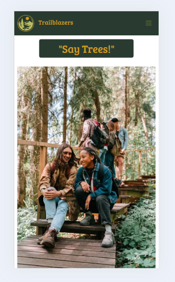

- High-Quality Images: The gallery features vibrant, well-composed photos from past hikes and events, showcasing scenic landscapes and joyful moments.

- Diversity and Inclusivity: The images reflect a welcoming and diverse community, aligning beautifully with your mission of queer-friendly outdoor experiences.

- Encourages Engagement: The visual storytelling gives potential participants a feel for the vibe and camaraderie, helping them imagine themselves as part of the adventure before booking.

### Booking Form  

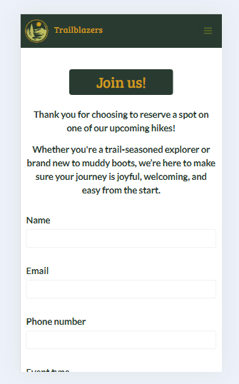

- Responsive Form: The form adapts well across screen sizes and collects:
  - Name
  - Email
  - Event type (via dropdown)
  - Special requests (via textarea)
- Form Validation: Required fields are enforced, preventing incomplete submissions.
- Confirmation Behavior: After submission, users are redirected to a confirmation page, which reassures them that their inquiry was received.

### About Us Page

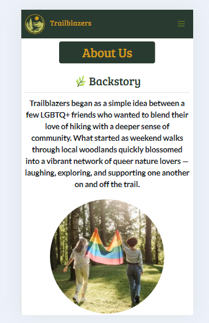

- Shares our backstory, mission and values, helping users understand the heart behind Trailblazers.

- Builds trust and emotional connection with your audience.

- Reinforces your commitment to queer-friendly outdoor experiences.

### Beginner's Guide Page

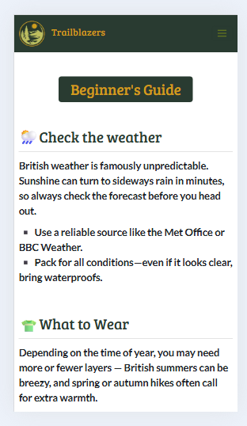

- Offers practical advice for new hikers, lowering barriers to entry.

- Aligns with inclusive ethos by making outdoor adventures feel approachable.

- Adds educational value, which enhances the overall user experience.

## Contact section

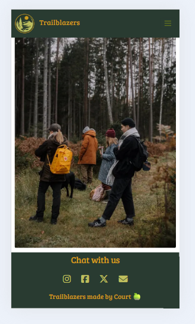

- Social Media Icons: The footer includes clickable icons for platforms like Instagram and Facebook that open in a new tab.

- External Messaging: These links open in new tabs and direct users to your social profiles, where they can send messages or follow updates.

- Responsive Design: The icons are styled consistently and remain accessible across screen sizes.

### Footer

- Footer Text: It includes the phrase “Trailblazers made by court 🍎”.

- Accessibility & Mobile-Friendliness: The footer layout is clean, readable, and responsive across screen sizes. Text contrast is solid, and the spacing adapts well for smaller devices.

## Future Enchancements

While Trailblazers already provides an inclusive and user-friendly platform, there are enhancements planned to further improve the user experience and support community growth.  

- Form Confirmation Feedback
 Currently, form submissions redirect users to a confirmation page. Adding a more visually engaging confirmation message or animation after submission would reinforce successful interaction, provide immediate reassurance, and make the booking process feel more rewarding.

- Expanded Beginner’s Guide
I would include downloadable checklists, gear recommendations, and safety tips tailored to different hike types and seasons. This improvement specifically supports new hikers who may feel anxious or underprepared, helping to remove barriers to participation and build confidence.

- User Testimonials Section  
Featuring testimonials from past participants helps showcase the heart of the community. For first-time users, reading authentic experiences builds trust and connection, gently encouraging them to take that first step and join an event.

## Technologies Used

### Languages

- HTML
- CSS

### Libraries & Framework

- [Google Fonts](https://fonts.google.com/selection)
- [Fav Icon](https://fontawesome.com/)
- [Bootstrap](https://getbootstrap.com/)

### Tools

- [Github](https://github.com/)
- [Balsamiq](https://balsamiq.com/)
- [W3C HTML Validation Service](https://validator.w3.org/)
- [W3C CSS Validation Service](https://jigsaw.w3.org/css-validator/)
- [Color Contrast Accessibility Validator](https://jigsaw.w3.org/css-validator/)
  https://www.audioeye.com/color-contrast-checker/
- [Canva](https://www.canva.com/)
- [Sqooush](https://squoosh.app/)

## Testing

### Bugs

|                         Bug                         |   Status   |                                                                 Description                                                                |                                                              Steps To Resolve                                                              |   |   |
|:---------------------------------------------------:|:----------:|:------------------------------------------------------------------------------------------------------------------------------------------:|:------------------------------------------------------------------------------------------------------------------------------------------:|---|---|
| Hero image not filling full screen                  | fixed      | Hero image was not filling the whole header viewport.                                                                                      | Adjusted styling so the hero image fills the full header height.                                                                           |   |   |
| Trouble with opacity on hero image                  | fixed      | The hero image was a background image. I added opacity in CSS to the image, it only applied to text.                                       | Changed the background image to an  tag in HTML and styled in CSS. Added a div with the class of overlay to apply opacity.        |   |   |
| Lighthouse performance score in the orange.                  | unresolved | LCP (Largest Contentful Paint) score was high, affecting performance. Had trouble reducing it.                                             | Getting different scores in Lighthouse; large LCP likely due to many images on the home page.                                              |   |   |
| Removing padding from Bootstrap card footer         | fixed      | I wanted to remove the padding from the footer on Bootstrap's cards for aesthetics.                                                        | Had to apply !important to override Bootstrap’s code.                                                                                     |   |   |
| Card text heights on laptop are constantly changing | fixed      | Text heights in cards vary on different laptop displays.                                                                                    | Added a media query for desktop breakpoints to align text horizontally.                                                                    |   |   |
| Invalid column class                                | fixed      | Accidentally joined two column classes together.                                                                                           | Separated column classes with a space.                                                                                                     |   |   |
| Phone input used type=number                      | fixed      | The phone input was set up as a number field, so it showed things like arrows and allowed odd formats that aren’t right for phone numbers. | Changed to type="tel"  so it works better for phone numbers and shows the right keyboard on phones.                                       |   |   |
| Social icons not appearing on About Us page         | fixed      | Pasted social icons into About Us page but they weren’t appearing.                                                                         | Forgot to add Font Awesome link to About Us page when pasting over social icons.                                                           |   |   |
| Anchor headings hidden behind navbar                | unresolved | When clicking nav links, the target section’s heading is obscured by the fixed navbar on desktop. As well as gallery heading on other screens                                                     | Tried applying scroll-margin-top to target elements, but headings still partially hidden — needs further testing.                        |   |   |
### Responsiveness Tests

To ensure optimal responsiveness, I launched the website early in its development. Adopting a mobile-first approach, I tested every modification using the built-in Developer Tools in Google Chrome to preview how the site appears on different screen sizes. Once deployed, I used Am I Responsive to gain a unified preview of the live site across various breakpoints.

| Size | Device Example | Navigation | Element Alignments | Content Placement | Functionality | Notes |
| :--: | :------------: | :--------: | :----------------: | :---------------: | :-----------: | :---: |
|  sm  |   iphone SE    |    Good    |        Good        |       Good        |     Good      |       |
|  sm  |   iPhone XR    |    Good    |        Good        |       Good        |     Good      |       |
|  sm  | iPhone 12 pro  |    Good    |        Good        |       Good        |     Good      |       |
|  md  |   iPad mini    |    Good    |        Good        |       Good        |     Good      |       |
|  md  |    iPad Air    |    Good    |        Good        |       Good        |     Good      |       |
|  lg  |    iPad Pro    |    Good    |        Good        |       Good        |     Good      |       |
|  xl  |    Nest Hub    |    satifactory    |        Good        |       Good        |     Good      |   Navbar covers some headings    |
| xxl  |  Nest Hub Max  |    satifactory    |        Good        |       Good        |     Good      |   Navbar covers some headings    |
| xxl  |    Desktop     |    satifactory    |        Good        |       Good        |     Good      |   Navbar covers some headings    |

## Code Validation

### HTML

I have used [W3C HTML Validation Service](https://validator.w3.org/). I have tested 4 pages. The tests came back with 10 errors that i corrected as shown in the screenshots.  

### CSS

I have used [W3C CSS Validation Service](https://jigsaw.w3.org/css-validator/). I have tested 4 pages. It passed the first time.

## User Story Testing
| **User Story**                                                                                                                                     | **Result**                                                                                                   | **Pass** | **Screenshots**                                      |
|---------------------------------------------------------------------------------------------------------------------------------------------------|----------------------------------------------------------------------------------------------------------------|:--------:|------------------------------------------------------|
| As a user, I want clear details about each hike – including location, date, duration, and terrain, so I can decide if it's right for me           | Hike cards have clearly laid out information with icons                                                        |   Yes     | [Screenshot of hike cards](docs/usr-hike-cards.png)             |
| As a user, I want reassurance as a first-time hiker that there are events that are beginner-friendly                                              | Difficulty levels shown on cards. Encouraging language throughout website. Beginner’s Guide to Hiking added. |   Yes     | [Screen of beginner cards](docs/usr-beginner.png) [Screenshot of Beginner’s Guide](docs/usr-guide.png)   |
| As a user, I want to browse a gallery to get a feel for the community vibe                                                                        | Gallery shows hikers and scenery, conveying friendly, social atmosphere                                        |   Yes     |  [Screenshot of gallery section](docs/urs-gallery.png)                          |
| As a user, I want a simple and accessible way to book a hike and find contact information                                                         | Booking form is easy to use, with clear contact section and social icons                                       |   Yes     | [Screenshot of booking form](docs/urs-booking-form.png) [Screenshot of contact section](docs/usr-contact-us.png)       |
| As a user, I want to be able to see this is an inclusive space, without fear of discrimination                                                    | Inclusive language in About section and message under booking form                                             |   Yes     | [Screenshot of About section](docs/urs-about-us.png) [Screenshot of booking message](docs/urs-booking-form.png)      |
| As a user, I want to be able to use the website on phone, tablet, or desktop                                                                      | Fully responsive; tested on multiple screen sizes                                                              |   Yes     | [Screenshots of site on mobile, tablet, and desktop](docs/screen-view.png)   |
## Feature Testing

This website was extensively tested for functionality using Chrome developer tools.

## Lighthouse Testing

The Trailblazers website has been tested in Chrome Dev Tools using Lighthouse Testing tool which inspects and scores the website for the following criteria. I generated two sets of lighthouse reports, one for mobile and one for desktop. 

- Performance - how quickly a website loads and how quickly users can access it.
- Accessibility - test analyses how well people who use assistive technologies can use your website.
- Best Practices - checks whether the page is built on the modern standards of web development.  

I had some trouble with the performance scores when testing with lighthouse on my index page. I kept getting different scores which turned out to be because of the many images on the homepage. The scores are over 80 so im happy with the results.  

For my other pages, I received consistently high Lighthouse scores across performance, accessibility, best practices, and SEO. These pages are less image-heavy than the index page, which helped improve load times and Largest Contentful Paint (LCP). Streamlined layouts and minimal third-party scripts reduced render-blocking resources, while semantic HTML, clear heading structures, and thoughtful ARIA labeling supported strong accessibility scores. SEO remained solid thanks to descriptive meta tags, logical page hierarchies, and responsive design choices that prioritized user experience across devices.

## Mobile chrome Dev tools testing:
### Index:
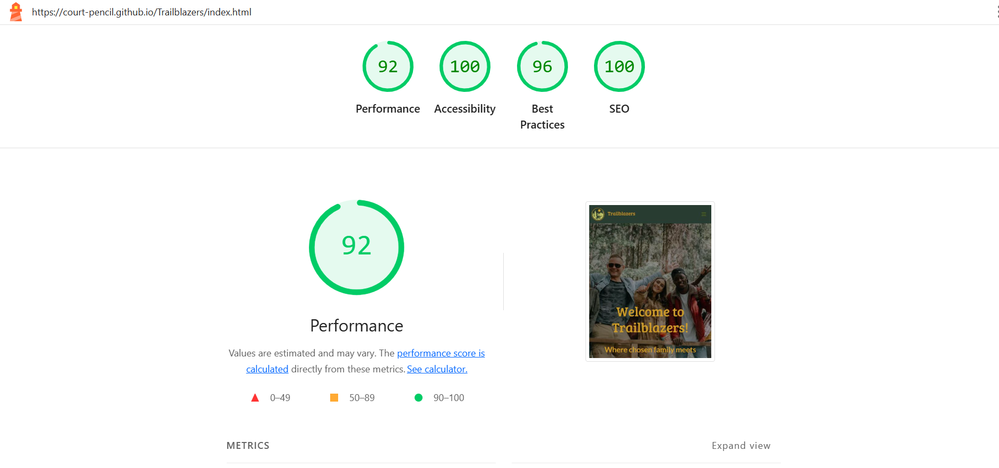
 
### About Us:

### Beginner's Guide:
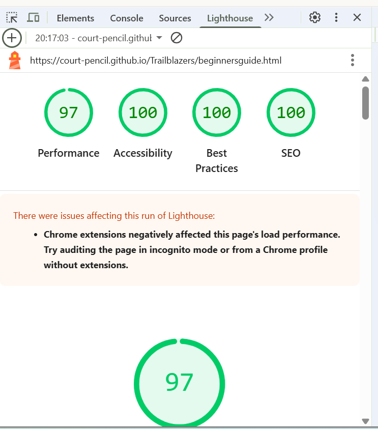

### Booking Form:
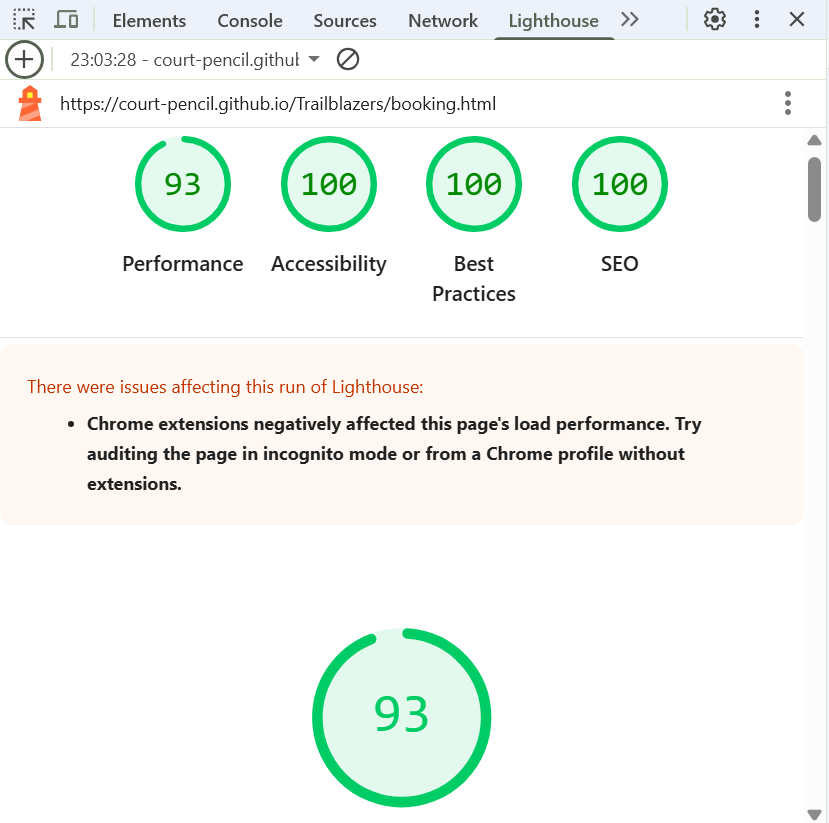

## Desktop chrome Dev tools testing:

### Index:
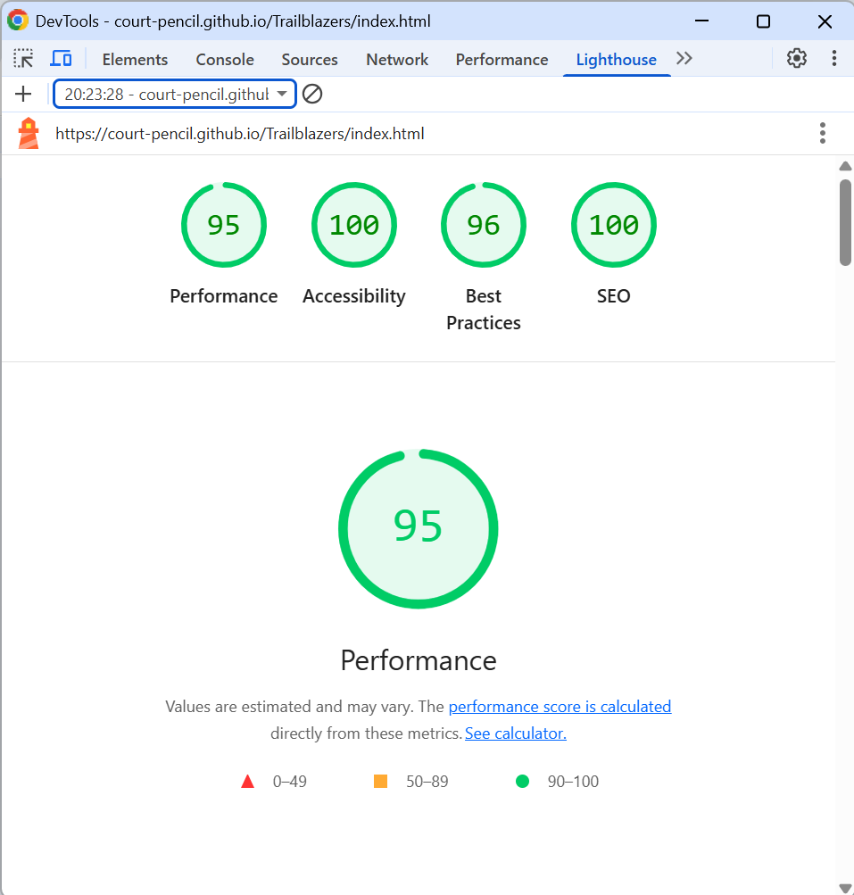 

### About Us:

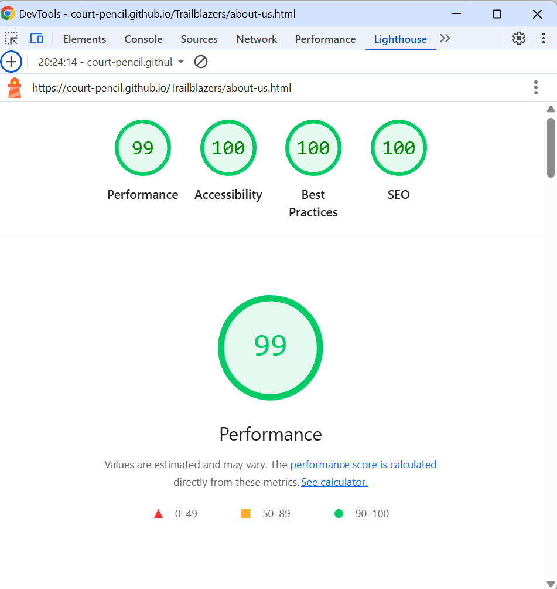

### Beginner's Guide:

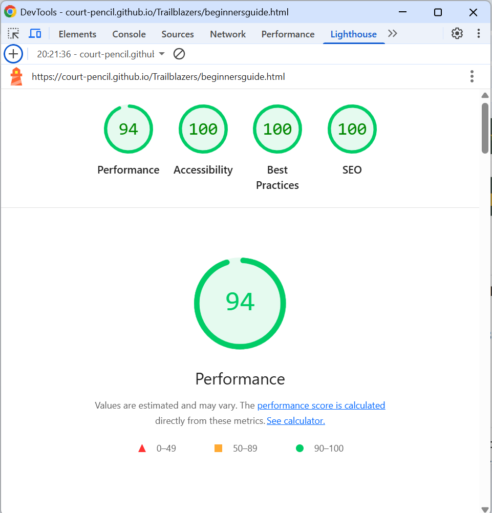

### Booking Form:

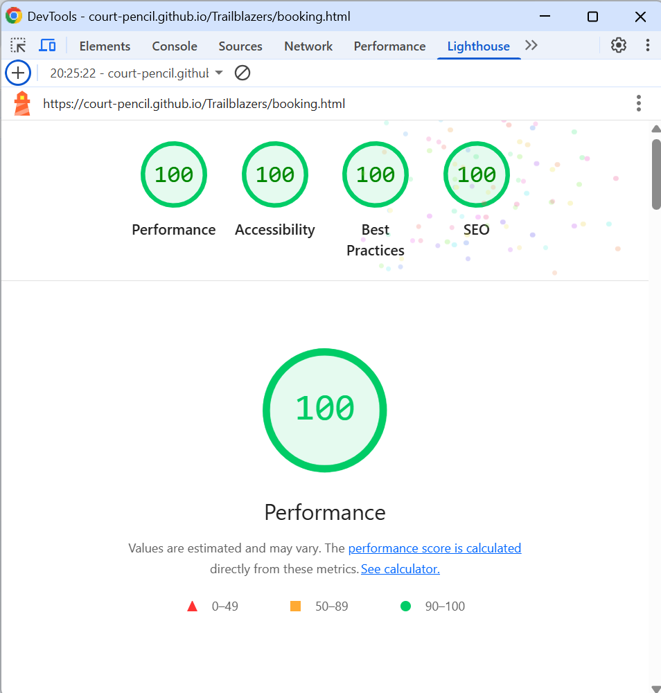

## Deployment

### To deploy the project

The Trailblazers website was deployed early in the process to GitHub pages via the following steps:

- Navigate to the repository on GitHub and click on Settings.

- In the side navigation and select Pages.

- In the None dropdown and choose Main.

- Click on the Save button.

The website is now live at https://Court-pencil.com.

Any changes required to the website, they can be made, committed and pushed to GitHub.

### To Fork the Project

Forking the GitHub repository allows you to create a duplicate of a local repository. This is done so that modifications to the copy can be performed without compromising the original repository.

- Log in to GitHub.
- Locate the repository.
- Click to open it.
- The fork button is located on the right side of the repository menu.
- To copy the repository to your GitHub account, click the button.

### To clone the project

- Log in to GitHub.
- Navigate to the main page of the repository and click Code.
- Copy the URL for the repository.
- Open your local IDE.
- Change the current working directory to the location where you want the cloned directory.
- Type git clone, and then paste the URL you copied earlier.
- Press Enter to create your local clone.

## Credits

- Feedback, advice and support:

  - [Simen Daehlin](https://github.com/Eventyret)

- Code inspiration and learning content:
- Visual content:
  - [Coolors](https://coolors.co/)
  - [Contrast Grid](https://contrast-grid.eightshapes.com/?version=1.1.0&background-colors=&foreground-colors=%23FFFFFF%2C%20White%0D%0A%23F2F2F2%0D%0A%23DDDDDD%0D%0A%23CCCCCC%0D%0A%23888888%0D%0A%23404040%2C%20Charcoal%0D%0A%23000000%2C%20Black%0D%0A%232F78C5%2C%20Effective%20on%20Extremes%0D%0A%230F60B6%2C%20Effective%20on%20Lights%0D%0A%23398EEA%2C%20Ineffective%0D%0A&es-color-form__tile-size=compact&es-color-form__show-contrast=aaa&es-color-form__show-contrast=aa&es-color-form__show-contrast=aa18&es-color-form__show-contrast=dnp)
- Images:

  - [Pexels](https://www.pexels.com/)
  - [Emojipedia](https://emojipedia.org/)  

- learning content:

  - [Code Institute](https://learn.codeinstitute.net/ci_program/diwad_v2_14)
  - [Kevin Powell CSS](https://www.youtube.com/@KevinPowell)
  
 
